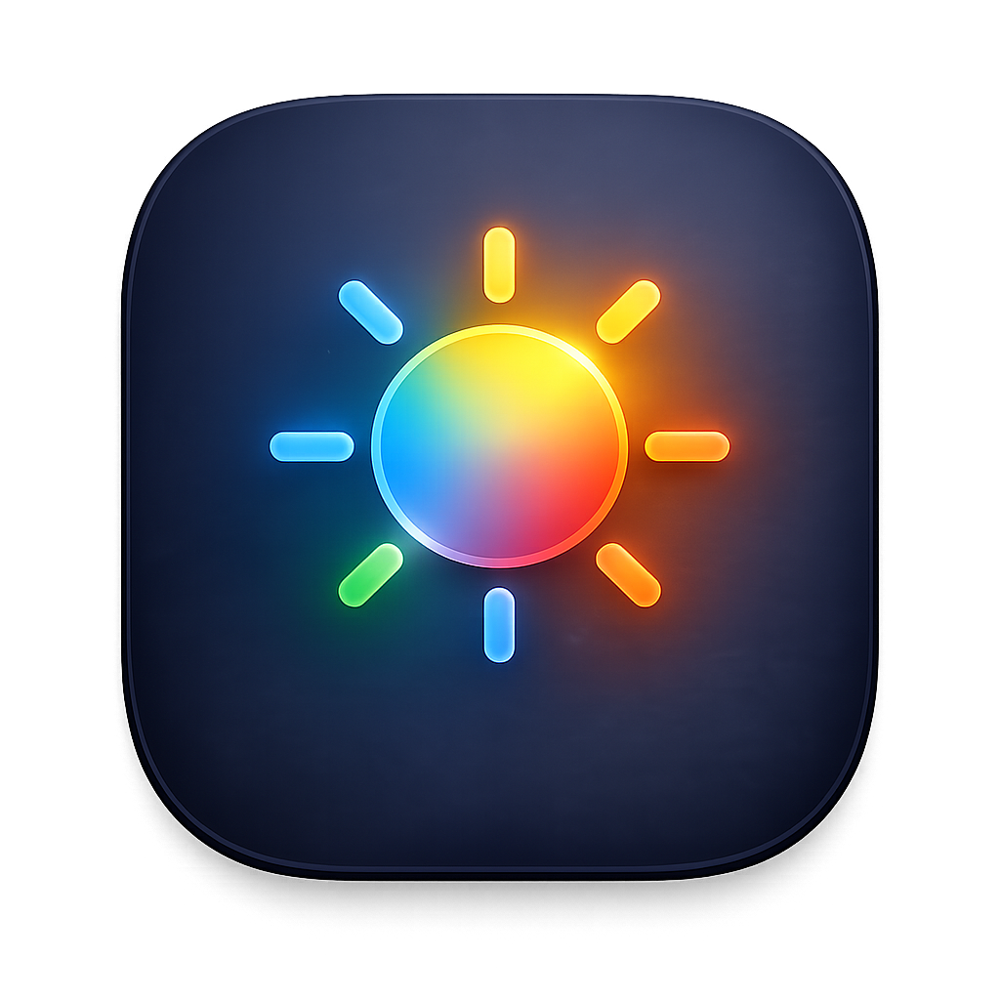

<p align="center">
  
</p>

# Display Studio

Control external monitors on macOS over DDC/CI — brightness, contrast, volume,
input source, colour, power, and arbitrary VCP codes — plus the built-in panel.
Includes a menu bar app, a command-line tool, and a background daemon.

Written in Rust. Apple Silicon, macOS 13+.

## Features

- DDC/CI control of external displays: brightness, contrast, volume, input
  switching, colour presets, screen orientation, power, and raw VCP codes.
- Built-in panel brightness.
- Menu bar app: per-monitor sliders and pickers, power off/on, profiles.
- Per-monitor customisation of which controls appear.
- Profiles: named snapshots of settings, saved and applied.
- Automation rules: react to display connect/disconnect, power source, or time.
- `displayctl` command-line tool with `--json` output.
- Capability report per monitor.
- Optional read-back verification of writes.

## Components

A per-user daemon (`displayd`) owns all hardware access and serialises I2C.
Other components are clients over a Unix-socket JSON-RPC protocol.

| Crate | Role |
|---|---|
| `display-core`, `display-ddc` | Display model and DDC/CI protocol (platform-independent) |
| `display-macos` | macOS backend (IOAVService, CoreGraphics, DisplayServices) |
| `display-daemon` (`displayd`) | Hardware access, profiles, automation, IPC server |
| `displayctl` | Command-line client |
| `display-gui` | Menu bar app (AppKit via `objc2`) |

## Build

Requires a Rust toolchain and macOS 13+.

```sh
cargo run --bin displayd &            # daemon
cargo run --bin displayctl -- list    # CLI
cargo run --bin display-gui           # menu bar app (starts the daemon itself)
```

## CLI

```sh
displayctl list
displayctl brightness 60 --display Dell
displayctl input 0x11 --display Dell --yes
displayctl profile save coding
displayctl profile apply coding --verify
```

## License

Dual-licensed under [MIT](LICENSE-MIT) or [Apache-2.0](LICENSE-APACHE), at your option.
